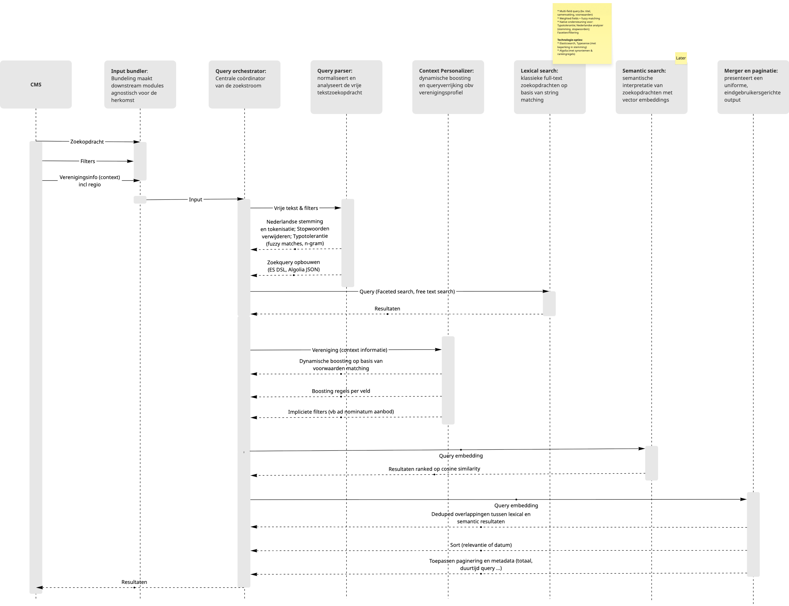
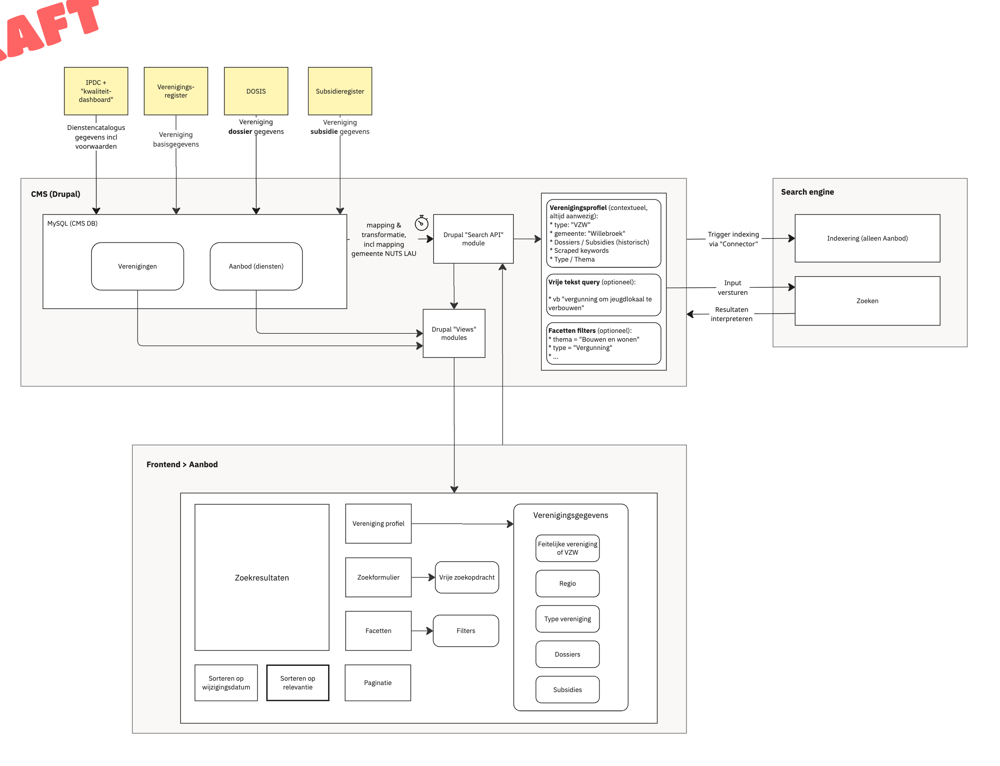

# Solution Architecture — Search Engine Component

**Doel:** Ondersteunen van een gepersonaliseerde, Nederlandstalige zoekervaring met uitbreidbare relevantie- en scoringslogica.

## Componentstructuur

```
┌─────────────────────────────────────────────────────┐
│                    Search Engine                    │
├─────────────────────────────────────────────────────┤
│ 0. Input Bundler                                    │
│ 1. Query Orchestrator                               │
│ 2. Query Parser                                     │
│ 3. Context Personalizer                             │
│ 4. Lexical Search Module                            │
│ 5. Semantic Search Module (optioneel)               │
│ 6. Merger & Paginator                               │
└─────────────────────────────────────────────────────┘
```

## Proces




### 0. Input Bundler

**Functie:** combineert de drie hoofdcomponenten van de zoekopdracht:

- Vrije tekst (vrije zoekopdracht)
- Filters (facetten geselecteerd in frontend)
- Verenigingsprofiel (type, regio, doelgroep, historiek…)

⤷ Allemaal aangeleverd vanuit het CMS/Frontend (Drupal)
⤷ Bundeling maakt downstream modules agnostisch voor de herkomst

### 1. Query Orchestrator

**Functie:** centrale coördinator van de zoekstroom

- Roept Query Parser aan voor tekstuele normalisatie
- Roept Context Personalizer aan voor het verrijken van boostregels
- Beslist op basis van config of Semantic Search wordt ingeschakeld
- Verzamelt resultaten van de actieve modules en stuurt ze naar ranking & merge

### 2 Query Parser

**Functie:** normaliseert en analyseert de vrije tekstzoekopdracht

- Past Nederlandse stemming en tokenisatie toe
- Verwijdert stopwoorden
- Past typotolerantie toe voor fuzzy matches
- Bouwt backend-specifieke zoekqueries (bv. Elastic DSL, Typesense JSON)
- Let op: parser werkt apart voor lexical en semantic pipelines

### 3. Full-text search (lexical search)

**Functie:** klassieke full-text zoekopdrachten op basis van string matching

- Multi-field query (bv. titel, samenvatting, voorwaarden)

```json
"multi_match": {
  "query": "vergunning",
  "fields": [
    "naam^3",
    "keywords^5",
    "omschrijving^2",
    "thema^1.5",
    "type^2"
  ],
  "fuzziness": "AUTO"
}
```

- Weighted fields + fuzzy matching
- Native ondersteuning voor:
  - Typotolerantie
  - Nederlandse analyzer (stemming, stopwoorden)
  - Facetten/filtering

#### Voorbeeld customer analyzer Elastic Search

```json
"analysis": {
  "analyzer": {
    "custom_dutch_analyzer": {
      "tokenizer": "standard",
      "filter": [
        "lowercase",
        "dutch_stop",
        "dutch_stemmer",
        "synonym_filter",
        "edge_ngram_filter"
      ]
    }
  },
  "filter": {
    "dutch_stop": { "type": "stop", "stopwords": "_dutch_" },
    "dutch_stemmer": { "type": "stemmer", "language": "dutch" },
    "synonym_filter": {
      "type": "synonym",
      "synonyms": [
        "omgevingsvergunning, bouwvergunning, stedenbouw"
      ]
    },
    "edge_ngram_filter": {
      "type": "edge_ngram",
      "min_gram": 2,
      "max_gram": 20
    }
  }
}
```


### 4. Context Personalisatie

**Functie:** dynamische boosting en queryverrijking op basis van verenigingsprofiel

- Past mapping voorwaarden als `type vereniging`, `doelgroep`, `gemeente` toe in de query
- Bepaalt **boostingregels** per veld (bv. `type` zwaarder dan `thema`)
- Voeg **impliciete filters** toe (bv. uitsluiten ad-nominatum-diensten)


### 5. Semantic Search (optioneel)

**Functie:** semantische interpretatie van zoekopdrachten met vector embeddings

- Zet vrije tekst om naar vector via encoder (bv. SBERT-NL)
- Vergelijkt met geëncodeerde vectoren van dienstbeschrijvingen
- Rankt op basis van cosine similarity
- Laat zich later uitbreiden met reranking via LLM (bv. cross-encoder of instruct-based reranker)


### 6. Merge resultaat en organiseer

**Functie:** presenteert een uniforme, eindgebruikersgerichte output

- Combineert:
  - Lexical score
  - Semantic score
  - Boostregels op basis van profiel
  - Hard filters (uitsluitingen, ad-nominatum)
- Dedupliceert overlappingen tussen lexical en semantic resultaten
- Final sort (relevantie of datum)
- Toepassen van paginering & metadata (totaal aantal, responsetijd)

---

## Integratie met bestaande componenten



De frontend is vandaag al verantwoordelijk voor het vormgeven van de zoekervaring voor de gebruiker. Ze biedt:
- Een zoekformulier voor vrije tekstzoekopdrachten
- Facetten (filters) zoals thema, type aanvraag
- Paginering en sortering (op wijzigingsdatum of relevantie)
- Toont de zoekresultaten zoals ze aangeleverd worden door de Drupal Views
- Visualisatie van het verenigingprofiel

### Wat verwacht de search engine van het CMS (en diens Search API module)?

1. Voor indexatie
    - Een trigger voor indexering (periodiek)
    - Alleen aanbod-gegevens (diensten) moeten geïndexeerd worden, verrijkt met:
    - NUTS/LAU mapping

2. Voor zoekopdrachten
    - Gecombineerde input van de gebruiker (via frontend):
    - Vrije tekst (optioneel)
    - Filters/facetten (optioneel)
    - Verenigingsprofiel (altijd aanwezig indien gebruiker is aangemeld):
        - Thema, type (bv. jeugdvereniging), vzw of feitelijke vereniging
        - Gemeente én NUTS/LAU mapping, zowel id als string
        - Identifier (om ad nominatum resultaten al dan niet te filteren)
        - Historiek: dossiers, subsidies
    - Deze informatie moet in de Search API module worden:
        - Gebundeld tot een backend-query
        - Doorgestuurd naar de zoekengine
        - Resultaten moeten worden ontvangen, geïnterpreteerd en gestructureerd
        - Doorgegeven aan Drupal Views, zodat frontend ze kan presenteren

---

## Plan van Aanpak — Fasegewijze Uitbouw Zoekmachine

**Doel:** De zoekengine gefaseerd opbouwen — van het reproduceren van de huidige werking tot een gepersonaliseerde, semantisch verrijkte zoekervaring met evaluatielus.

### Stap 1: Reproductie van de bestaande werking

**Doel:** Wat Drupal vandaag kan, moet ook kunnen met de nieuwe engine.

**Functionaliteit:**
- Vrije tekst zoekopdracht
- Filters / facetten
- Sorteren op datum of relevantie
- Paginering

**Actieve modules:**
- Input Bundler
- Query Orchestrator
- Query Parser
- Lexical Search Module (baseline)
- Filter Engine
- Merger & Paginator

## Stap 2: Lexical Search uitbreiden

**Doel:** Verbeterde zoekresultaten via tekstuele verrijking.

**Toevoegen:**
- Typotolerantie (fuzzy matching)
- Nederlandse stemming
- Gewichten per veld (bv. titel > voorwaarden)
- Statische boostingregels

**Uitgebreide modules:**
- Lexical Search Module (met boosts)
- Query Parser (met NLP-analyzer)
- Eerste versie van Scoring & Ranker

## Stap 3: Contextualisatie / personalisatie

**Doel:** Zoekresultaten afstemmen op het profiel van de vereniging.

**Contextuele logica:**
- Dynamische boosting op basis van type/regio/doelgroep
- Impliciete filters (bv. ad-nominatum uitsluiten)

**Nieuw:**
- Context Personalizer
- Scoring & Ranker (met profielafhankelijke boosts)

## Stap 4: Semantische zoekuitbreiding

**Doel:** Betekenis-gebaseerde matching toevoegen (vector search).

**Vernieuwingen:**
- Vector encoder (bv. SBERT-NL)
- Vector index + cosine similarity
- Mogelijke uitbreiding met reranking via LLM

**Modules:**
- Semantic Search Module
- Combinatie van lexical + semantic in Merger & Paginator
- Ranker combineert beide scores

## Stap 5: Evaluatie & feedbackloop

**Doel:** Objectieve meting van relevantie en continue verbetering.

**Evaluatieaanpak:**
- Testcases met manueel verwachte resultaten (offline)
- Annotaties van relevantie (qrels)
- Logging van gebruikersinteractie (bv. clicks, zero-result queries)
- “Waarom aanbevolen?” uitleg bij resultaten (transparantie)

**Opvolging:**
- Verfijnen boostingregels
- Training van eventueel ML-model (learning to rank)
- Iteratief verbeteren
